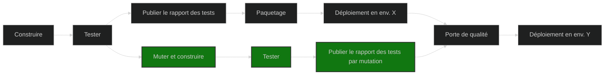

# nexlab.mutationtesting
Exploration des tests par mutation

## Introduction
*nexlab.mutationtesting* est un projet d'exploration initié par les développeurs(ses) chez [Nexus Innovations](https://nexusinno.com/) pour analyser la pratique, les outils afin de d'appliquer celle-ci dans un contexte favorable.

### Qu'est-ce que les tests par mutation ?
En développement logiciel, la gestion de la qualité se concentre souvent à coder des tests automatisés dont le rôle est de s'assurer du bon fonctionnement d'un comportement dans un processus d'intégration en continue.

Pour mesurer la qualité, les tests automatisés permettent d'obtenir le % de tests réussis et aussi la couverture du code testé par les tests automatisés. Est-ce suffisant pour dire que l'application fonctionne vraiment ?

La réponse est non. L'une des raisons est que **100% des tests réussis et 100% de couverture du code par les tests ne veut pas dire que le code est testés et vérifiés entièrement**. On parle ici de l'efficacité des tests à trouver des anomalies.

C'est ainsi que les tests par mutation permettent d'obtenir une métrique additionnelle afin d'ajouter de la stabilité en simulant des anomalies dans le code testé (des mutants) et relancer les tests pour vérifier que chaque anomalie a fait échoué un ou plusieurs tests (nombre de mutants tués).

## Comment l'appliquer ?

Il existe plusieurs outils selon la technologie utilisés, cependant le processus se résume à ceci:

Notez bien que si des anomalies sont trouvés sans mutation, le processus s'arrête car les données du rapport de mutation seraient fausses.

## En pratiques

Le context du projet à développer doit être favorable. En d'autres mots, la qualité doit être un attribut important pour la réussite du projet et soutenu par les intervenants.

La gestion de la qualité doit nécessairement passer par des tests automatisés afin d'appliquer des tests par mutation.

### Avantages

1. Offre un aperçu sur l'efficacité des tests à attraper des comportements indésirables
1. Prévient des erreurs de régression lorsqu'on bonifie les tests afin d'attraper des mutants ayant survécus
1. Réduit des allers-retours causés par des anomalies identifié lors de tests manuelles
1. Augmente la qualité des tests pour gagner en confiance sur la stabilité

### Inconvénients

1. Coût d'exécution des tests par mutation ralentit l'intégration en continue
1. Effort accrue pour le développement des tests automatisés
1. Ajout d'une responsabilité à analyser le rapport de tests par mutation
1. L'efficacité des tests par mutation dépend des possibilités qu'offre l'outil de mutation et ne peut pas simuler tous les types de modification

### Défis et risques

Adopter les tests par mutation ne doit pas être perçu comme une tâches en extra ou même exclus du développement d'une fonctionnalité. La culture de gestion de la qualité en pratique ne doit pas se restreindre à chasser des mutants et atteindre une couverture de test acceptable.

#### Attentes irréalistes

Viser une couverture de tests de 100% et 0 survivants parmi les mutants sur l'entièreté du code est plutôt une utopie. Techniquement l'entièrement du code possèdent différent niveau de testabilité et de pertinence à être testé. 

Du code qu'on appel parfois de plomberie dont la pertinence d'effectuer des mutations serait remis en question. L'enregistrement de services pour l'injection des dépendances, la gestion de traitement asynchrone par exemple peut être du code mutable mais difficile à attraper ou possiblement non pertinent.

Ainsi, nous devons choisir le code qui est soumis aux tests par mutation.

#### La chasse aux mutants

Maintenant que la chasse aux mutants est commencée, le premier problème est qu'il risque fort d'y avoir beaucoup plus de mutants que les développeurs peuvent gérer dans un effort acceptable. 

Si on exige qu'aucun mutant doit survivre, les développeurs vont passer beaucoup de temps à les attraper et seront tentés de vouloir tricher la métrique pour respecter ce standard. Aussi, attraper tous les mutants va générer beaucoup de tests automatisés peu pertinents, abstraits dont la maintenance sera coûteuse et souffrante. 

C'est pourquoi l'équipe de développement se doit d'évaluer les mutations selon leurs contexte.

#### Attraper les plus importants

Si par exemple un standard de qualité exige d'attraper 85% des mutants, un problème est qu'on veut idéalement attraper les mutants les plus importants et dommageable.

Techniquement la mise en place de filtres pour identifier ceux-ci est possible mais demande une période d'adaptation et de la maintenance. Il est inévitable que **le rapport des mutants survivants doit être surveillé** afin de réagir. Car, évidemment, le nombre total de mutants survivant sera le même pour une modification au code qui laisse nouvellement passer un mutant très dommageable, mais attrape un autre moins important.

#### Intégration en continue difficile

Idéalement les étapes en vert sont ajoutés dans le processus d'intégration en continue pour attraper des régressions tôt pendant le développement et agir rapidement. 

Par contre, le temps d'exécution de ces étapes risque fort de causer un problème. 
Il est possible d'user de stratégies pour minimiser l'impacte. Par exemple: 
- Exécuter une analyse complète des tests de mutation pendant la nuit
- Exécuter les tests de mutation en parallèle

- Réduire l'étendu des tests par mutation selon les changements aux codes et aux tests
- Limiter la portée analysée en filtrant le code non-pertinent à tester. Le code squelette (*boilerplate*) par exemple

##### Outil
Pour ce faire, l'outil [Stryker](https://stryker-mutator.io/) offre des options pour aider à réduire la charge de travail. Les options disponibles dépendent de la technologie utilisé, par exemple:
- *Incremental mode* pour JavaScript
- *Since* et *Baseline* pour C#

⚠ Certaines options sont expérimentales et sans garantis de l'exactitude du résultat.

## Recommandations

Avant d'intégrer les tests par mutation, on doit avoir minimalement un processus de qualité sensible au % de couverture des tests automatisés. 

Aussi, c'est un outil qui ne s'apprête pas bien pour des tests d'intégrations, de systèmes ou bout en bout. On obtient de meilleurs résultats quand appliqué sur des tests unitaires ou fonctionnels sur une librairie.

Ceci dit, il est recommandé de focuser les tests de mutation sur la logique d'affaire. Par exemple, pour un projet inspiré de l'architecture propre .([CleanArchitecture de Jason Taylor](https://github.com/jasontaylordev/CleanArchitecture)), les couches application et domaine seraient ciblées pour calculer le pointage de mutation.

Une approche d'amélioration en continue est recommandée pour faciliter l'intégration de la pratique. Pour ceux qui travail en sprint par exemple, quelques points d'amélioration pourraient servir à extraire un premier rapport de test de mutation et d'en faire l'analyse. De la dette technique pourrait être identifiée. On évalue le pour et le contre de l'outil selon le contexte, pour confirmer ou non son utilisation. Une stratégie d'intégration en continue serait l'objectif des prochaines étapes advenant l'adaptation de l'outil pour le projet.

Si l'intégration en continue s'appui sur une porte de qualité, l'ajout d'une sensibilité au pointage de mutation serait cohérent pour bonifier la robustesse. Un seuil similaire à celui de la couverture serait acceptable.

Globalement, on doit éviter le piège de simplement transformer les développeurs en chasseurs de mutants pour atteindre un seuil de pointage de mutation imposé. L'outil doit être au service du développement afin d'améliorer la stabilité du produit. Les membres de l'équipe doivent en comprendre le fondement et s'en servir dans le bon contexte et adéquatement.

## Références

[Awesome Mutation testing](https://github.com/theofidry/awesome-mutation-testing): Répertoire GitHub très riches en information

[Don't chase test coverage](https://www.youtube.com/watch?v=BVErL_Ez9LI): Capsule de Dave Farley (Continuous Delivery) qui expose les faiblesses de la métrique de couverture du code par les tests - Août 2023

[C# Unit Tests With Mutation Testing](https://www.youtube.com/watch?v=9BoKyeZapLs): Webinar JetBrains avec l'invité Stefan Pölz (Clean C# Code & TDD) ([twitter](https://twitter.com/0x_F0)) - 4 Mai 2023

[An introduction to mutation testing](https://www.cs.cornell.edu/~dgeisler/mutation/testing/2021/11/01/mutation-testing1.html): Article en 3 parties qui expose la base mais aussi la tendance en pratique, des problèmes rencontrés et plus... par Dietrich Geisler - 8 Novembre 2021

[Increase the quality of unit tests using mutation with PITest](https://dev.to/silviobuss/increase-the-quality-of-unit-tests-using-mutation-with-pitest-3b27/): Article qui expose un cas les bienfaits d'intégrer les tests de mutation en JAVA par Silvio Buss - 17 Juillet 2019

[An industrial application of mutation testing: lessons, challenges and research](https://homes.cs.washington.edu/~rjust/publ/industrial_mutation_icst_2018.pdf): Papier complet d'un étude de cas en 2018 sur l'application de la pratique chez Google entre autres... par
- Google Switzerland: Goran Petrovic, Marko Ivankovi
- George Mason University USA: Bob Kurtz, Paul Ammann
- University of Massachusetts USA: René Just

[Mutation Testing](http://blog.cleancoder.com/uncle-bob/2016/06/10/MutationTesting.html): Article qui expose les avantages et les implications des tests par mutation par Robert C. Martin (Uncle Bob) - 10 Juin 2016