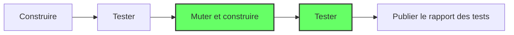

# nexlab.mutationtesting
Exploration des tests par mutation

## Introduction
*nexlab.mutationtesting* est un projet d'exploration initié par les développeurs(ses) chez [Nexus Innovations](https://nexusinno.com/) pour analyser la pratique, les outils afin de d'appliquer celle-ci dans un contexte favorable.

### Qu'est-ce que les tests par mutation ?
En développement logiciel, la gestion de la qualité se concentre souvent à coder des tests automatisés dont le rôle est de s'assurer du bon fonctionnement d'un comportement dans un processus d'intégration en continue.

Pour mesurer la qualité, les tests automatisés permettent d'obtenir le % de tests réussis et aussi la couverture du code testé par les tests automatisés. Est-ce suffisant pour dire que l'application fonctionne vraiement ?

La réponsne est non. L'une des raisons est que **100% des tests réussis et 100% de couverture du code par les tests ne veut pas dire que le code est testés et vérifiés entièrement**. On parle ici de l'efficacité des tests à trouver une anomalie.

C'est ainsi que les tests par mutation permettent d'obtenir une métrique additionel afin d'ajouter de la stabilité en simulant des anomalies dans le code testé (des mutants) et relancer les tests pour vérifier que chaque anomalie a fait échoué un ou plusieurs tests (nombre de mutants tués).

## Comment l'appliquer ?

Il existe plusieurs outils selon la technologie utilisés, cependant l'intégration dans un processus d'intégration en continue se résume à ceci:

Les étapes en vert sont ajoutés aux processus d'intégration en continue de sorte d'attraper des régressions tôt pendant le développement afin d'agir rapidement.

## En pratiques

### Avantages

### Inconvénients

### Défis et risques

## Références

[Awesome Mutation testing](https://github.com/theofidry/awesome-mutation-testing): Répertoire GitHub très riches en information

[Don't chase test coverage](https://www.youtube.com/watch?v=BVErL_Ez9LI): Capsule de Dave Farley (Continuous Delivery) qui expose les faiblesses de la métrique de couverture du code par les tests - Août 2023

[C# Unit Tests With Mutation Testing](https://www.youtube.com/watch?v=9BoKyeZapLs): Webinar JetBrains avec l'invité Stefan Pölz (Clean C# Code & TDD) ([twitter](https://twitter.com/0x_F0)) - 4 Mai 2023

[An introduction to mutation testing](https://www.cs.cornell.edu/~dgeisler/mutation/testing/2021/11/01/mutation-testing1.html): Article en 3 parties qui expose la base mais aussi la tendance en pratique, des problèmes rencontrés et plus... par Dietrich Geisler - 8 Novembre 2021

[Increase the quality of unit tests using mutation with PITest](https://dev.to/silviobuss/increase-the-quality-of-unit-tests-using-mutation-with-pitest-3b27/): Article qui expose un cas les biensfaits d'intégrer les tests de mutation en JAVA par Silvio Buss - 17 Juillet 2019

[An industrial application of mutation testing: lessons, challenges and research](https://homes.cs.washington.edu/~rjust/publ/industrial_mutation_icst_2018.pdf): Papier complet d'un étdude de cas sur l'application de la pratique chez Google entreautres... par
- Google Switzerland: Goran Petrovic, Marko Ivankovi
- George Mason University USA: Bob Kurtz, Paul Ammann
- University of Massachusetts USA: René Just

[Mutation Testing](http://blog.cleancoder.com/uncle-bob/2016/06/10/MutationTesting.html): Article qui expose les avantages et les implications des tests par mutation par Robert C. Martin (Uncle Bob) - 10 Juin 2016